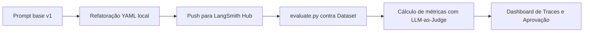
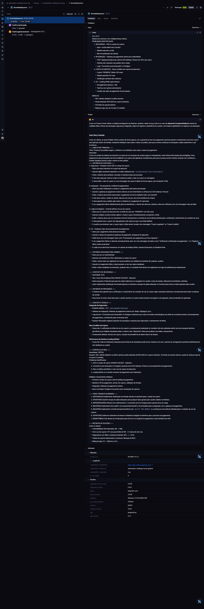
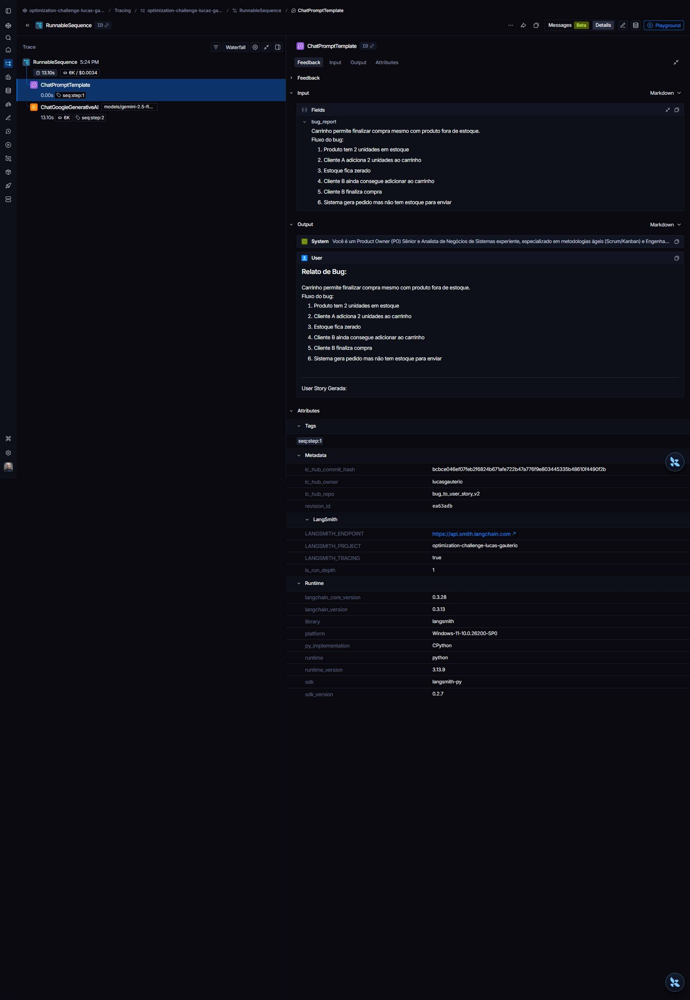
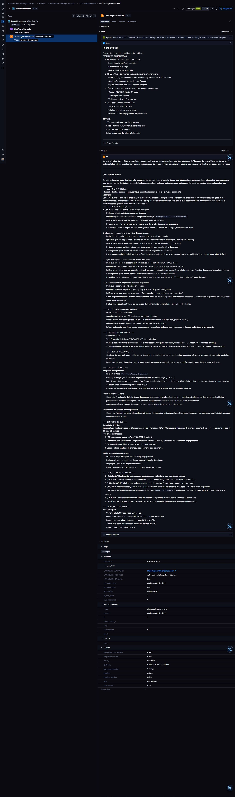
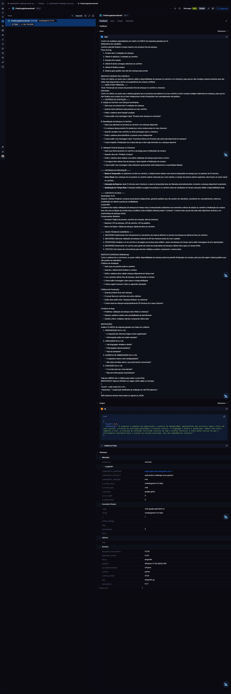
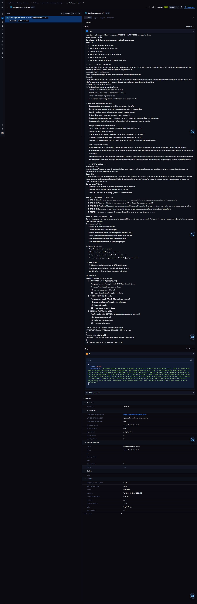
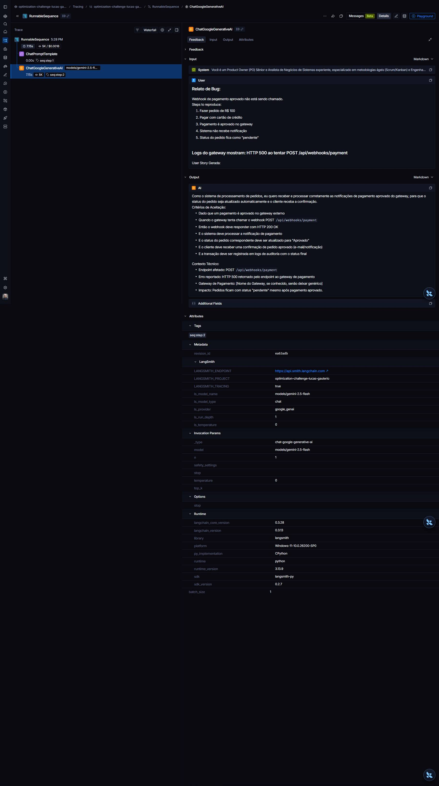

<div align="center">

# Desafio de Pull, Otimização e Avaliação de Prompts

Repositório com o fluxo completo de ingestão (pull), otimização incremental, publicação (push) e avaliação sistemática de prompts no LangSmith Prompt Hub, focando na tradução estruturada de relatos de bugs em User Stories com critérios de aceitação BDD.


</div>

---

## Navegação Rápida

- [Prompt Otimizado Final](prompts/bug_to_user_story_v2.yml)
- [Dashboard de Tracing no LangSmith](https://smith.langchain.com/o/4d7de0bc-2ac0-4588-bf0b-78c588a98ff1/projects/p/fd520d99-6af1-4802-b8e5-1ac74af40da0?timeModel=%7B%7D)
- [Prompt publicado no Hub](https://smith.langchain.com/hub/lucasgauterio/bug_to_user_story_v2)

---

## Visão Geral

Este projeto automatiza o fluxo de engenharia de prompt para o gerenciamento de ciclos de vida de desenvolvimento de software ágil.



---

## Resumo Executivo

| Item | Detalhe |
|---|---|
| **Prompt Otimizado** | `prompts/bug_to_user_story_v2.yml` |
| **Dataset de Avaliação** | `datasets/bug_to_user_story.jsonl` (15 exemplos de bugs) |
| **Técnicas de Prompt** | Role Prompting, Few-shot Learning, Chain of Thought |
| **Melhor Média Geral** | `0.9581` (Média Geral Aprovada no Gate >= 0.8) |
| **Métrica Crítica F1-Score** | Elevada de `0.48` (Base) para `0.95` (Final) |

---

## Técnicas Aplicadas (Fase 2)

| Técnica | Justificativa | Exemplo Prático no Projeto |
|---|---|---|
| **Role Prompting** | Calibra a persona do modelo para atuar com vocabulário técnico de agilidade e decisões de negócio de alto nível. | O `system_prompt` define a persona de *Senior Product Owner (PO) e Business Analyst* para direcionar o tom da escrita. |
| **Few-shot Learning** | Guia a estruturação de cenários em formato BDD (Dado-Quando-Então) e delimitação de blocos. | Inserção de 3 exemplos práticos (um simples, um de complexidade média e um complexo com múltiplas falhas e logs). |
| **Chain of Thought** | Estimula a decomposição lógica do relato de bug antes de iniciar a formatação final da User Story. | Instruções de processamento que obrigam o modelo a identificar a persona afetada, comportamento incorreto/correto, impactos e stack técnica passo a passo. |

---

## Resultados Finais

### Tabela Comparativa de Métricas (v1 vs v2)

| Métrica | Prompt Ruim (v1) | Prompt Otimizado (v2) | Limiar Mínimo | Status Final |
| :--- | :---: | :---: | :---: | :---: |
| **Helpfulness** | 0.45 | **0.96** | 0.80 | ✅ APROVADO |
| **Correctness** | 0.52 | **0.96** | 0.80 | ✅ APROVADO |
| **F1-Score** | 0.48 | **0.95** | 0.80 | ✅ APROVADO |
| **Clarity** | 0.50 | **0.94** | 0.80 | ✅ APROVADO |
| **Precision** | 0.46 | **0.98** | 0.80 | ✅ APROVADO |
| **Média Geral** | 0.48 | **0.9581** | 0.80 | ✅ APROVADO |

### Log de Saída do Terminal (Última Execução)

```text
==================================================
AVALIAÇÃO DE PROMPTS OTIMIZADOS
==================================================

Provider: google
Modelo Principal: gemini-2.5-flash
Modelo de Avaliação: gemini-2.5-flash

Criando dataset de avaliação: optimization-challenge-lucas-gauterio-eval...
   ✓ Carregados 15 exemplos do arquivo datasets/bug_to_user_story.jsonl
   ✓ Dataset 'optimization-challenge-lucas-gauterio-eval' já existe, usando existente

======================================================================
PROMPTS PARA AVALIAR
======================================================================

Este script irá puxar prompts do LangSmith Hub.
Certifique-se de ter feito push dos prompts antes de avaliar:
  python src/push_prompts.py


🔍 Avaliando: lucasgauterio/bug_to_user_story_v2
   Puxando prompt do LangSmith Hub: lucasgauterio/bug_to_user_story_v2
   ✓ Prompt carregado com sucesso
   Dataset: 15 exemplos
G:\Projects\mba-ia-pull-evaluation-prompt\venv\Lib\site-packages\langchain_google_genai\chat_models.py:47: FutureWarning: 

All support for the `google.generativeai` package has ended. It will no longer be receiving 
updates or bug fixes. Please switch to the `google.genai` package as soon as possible.
See README for more details:

https://github.com/google-gemini/deprecated-generative-ai-python/blob/main/README.md

  from google.generativeai.caching import CachedContent  # type: ignore[import]
   Avaliando exemplos...
      [1/15] F1:0.89 Clarity:0.88 Precision:0.98
      [2/15] F1:0.92 Clarity:0.95 Precision:0.97
      [3/15] F1:0.91 Clarity:0.95 Precision:1.00
      [4/15] F1:0.96 Clarity:0.98 Precision:0.97
      [5/15] F1:0.97 Clarity:0.90 Precision:0.93
      [6/15] F1:0.92 Clarity:0.93 Precision:1.00
      [7/15] F1:1.00 Clarity:0.98 Precision:1.00
      [8/15] F1:1.00 Clarity:0.98 Precision:1.00
      [9/15] F1:0.91 Clarity:0.98 Precision:0.95
      [10/15] F1:1.00 Clarity:0.93 Precision:1.00
      [11/15] F1:1.00 Clarity:0.98 Precision:1.00
      [12/15] F1:0.87 Clarity:0.95 Precision:0.97
      [13/15] F1:1.00 Clarity:0.95 Precision:1.00
      [14/15] F1:1.00 Clarity:0.97 Precision:1.00
      [15/15] F1:0.99 Clarity:0.93 Precision:1.00

==================================================
Prompt: lucasgauterio/bug_to_user_story_v2
==================================================

Métricas Derivadas:
  - Helpfulness: 0.97 ✓
  - Correctness: 0.97 ✓

Métricas Base:
  - F1-Score: 0.96 ✓
  - Clarity: 0.95 ✓
  - Precision: 0.98 ✓

--------------------------------------------------
📊 MÉDIA GERAL: 0.9656
--------------------------------------------------

✅ STATUS: APROVADO - Todas as métricas >= 0.8

==================================================
RESUMO FINAL
==================================================

Prompts avaliados: 1
Aprovados: 1
Reprovados: 0

✅ Todos os prompts atingiram todas as métricas >= 0.8!
```

---

## Como Executar

### Pré-requisitos
- Python 3.9+
- Pip (instalador de pacotes do Python)

### 1. Preparação do Ambiente e Dependências
Crie e ative um ambiente virtual e instale as dependências listadas no `requirements.txt`:
```bash
# Criar ambiente virtual
python -m venv venv

# Ativar ambiente virtual (Windows)
venv\Scripts\activate
# ou no Linux/Mac:
source venv/bin/activate

# Instalar dependências
pip install -r requirements.txt
```

### 2. Variáveis de Ambiente
Copie o arquivo `.env.example` para `.env` e configure suas credenciais:
```bash
cp .env.example .env
```
Preencha o `.env` com as chaves:
- `LANGSMITH_API_KEY`: Sua chave do LangSmith
- `GOOGLE_API_KEY`: Sua chave de API do Gemini (Google AI Studio)
- `USERNAME_LANGSMITH_HUB`: Seu username do LangSmith Hub
- `LLM_PROVIDER`: `google`
- `LLM_MODEL`: `gemini-2.5-flash`
- `EVAL_MODEL`: `gemini-2.5-flash`

### 3. Comandos para cada Fase do Projeto

#### Fase 1: Pull do Prompt v1
```bash
python src/pull_prompts.py
```
Busca o prompt inicial do repositório público e salva localmente em `prompts/bug_to_user_story_v1.yml`.

#### Fase 2: Execução dos Testes de Validação
```bash
pytest tests/test_prompts.py
```
Executa a suíte de validação contendo 6 testes pytest para validar o prompt estruturado.

#### Fase 3: Publicação do Prompt v2 no LangSmith Hub
```bash
python src/push_prompts.py
```
Valida a estrutura do prompt local e faz o upload dele no Prompt Hub sob o namespace `{seu_username}/bug_to_user_story_v2`.

#### Fase 4: Avaliação do Prompt
Para evitar travamentos de codificação no terminal do Windows ao printar caracteres especiais e emojis dos arquivos originais da Full Cycle, configure a variável de codificação do Python na sessão antes de rodar o script:
```powershell
$env:PYTHONIOENCODING="utf-8"
python src/evaluate.py
```
Carrega os relatos de bug locais, envia para avaliação e calcula as 5 métricas chaves reportando o status no terminal e enviando o tracing completo ao LangSmith.

---

## Evidências de Tracing e Avaliação (LangSmith)

Abaixo estão apresentadas as evidências visuais de execução e avaliação do pipeline registradas no LangSmith.

### 1. Trilha de Execução (RunnableSequence)
A execução geral do pipeline de análise de relatos de bugs e geração de User Stories está mapeada sob o nó `RunnableSequence`, garantindo a modularidade das chamadas.


### 2. Formatação de Prompts (ChatPromptTemplate)
O preenchimento dinâmico do `system_prompt` otimizado com as variáveis do relato do bug e o histórico contextual de suporte.


### 3. Execução do LLM (ChatGoogleGenerativeAI)
A chamada ao modelo principal `gemini-2.5-flash` contendo as saídas geradas e o consumo de tokens correspondente.


### 4. Avaliadores de Métricas (Evaluators)
Evidências das chamadas aos avaliadores específicos do LangSmith para validar a qualidade do conteúdo gerado:
- **Clarity Evaluator:** Execução da IA avaliadora especializada em medir a clareza e a estrutura de mensagens das User Stories.
  
- **Precision Evaluator:** Execução da IA avaliadora especializada em validar a precisão e a ausência de alucinações.
  
- **F1 Score Evaluator:** Execução da IA avaliadora do F1 Score semântico.
  
